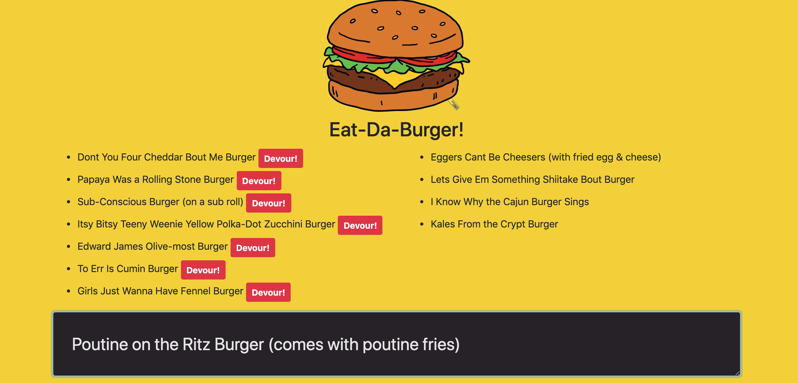

# Eat-Da-Burger

## Overview
Eat-Da-Burger is a restaurant app that allows the user to input the name of burgers that they would like to eat. Each burger in the waiting area has a Devour button. When the user clicks it, the burger will move to the right side of the page. All burgers are stored in MySQL database.

## Usage
Eat-Da-Burger app is deployed on Heroku. User must go to [link to heroku] to view the app. This will load the homepage which will allow the user to submit a burger's name from the input field. Once the user submits a name, it will appear on the left side. If the user selects the Devour button, the burger will be eaten and moved to the right side. 

## Examples
### Images:

Screenshot of the Homepage

## Technologies
The Eat-Da-Burger app was created using these technologies
* JavaScipt
* JQuery
* Node.js
* Heroku
* Handlebars
* MySQL
* NPM Packages
    * Express
    * Path
* Model-View-Controller (MVC)

## GITHUB
[github link](https://github.com/saronnhong/burger)

## My Role
My role in the app development was to create the Eat-Da-Burger app based on instructions from UCSD Extension Full Stack Bootcamp. 
 